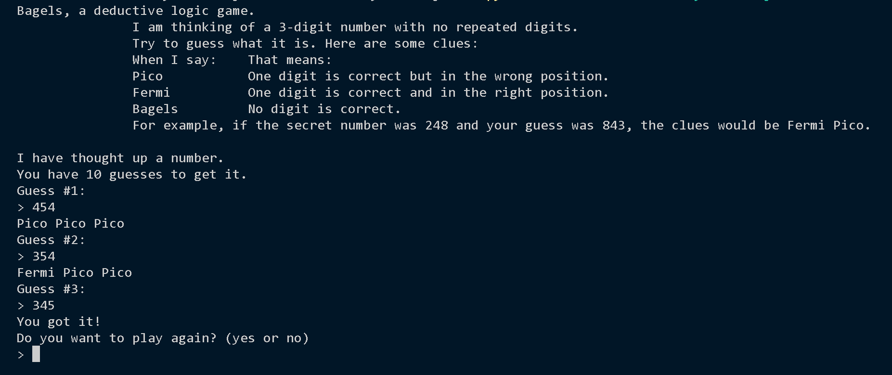

# 
# BANGELS

In Bagels, a deductive logic game, you 
must guess a secret three-digit number 
based on clues. The game offers one of 
the following hints in response to your guess: 
“Pico” when your guess has a correct digit in the 
wrong place, “Fermi” when your guess has a correct 
digit in the correct place, and “Bagels” if your guess 
has no correct digits. You have 10 tries to guess the 
secret number.

# The Program in Action

When you run ```bagels.py```, the output will look like this:




# How It Works 

Keep in mind that this program uses not integer values but rather string 
values that contain numeric digits. For example, '426' is a different value 
than 426. We need to do this because we are performing string comparisons 
with the secret number, not math operations. Remember that '0' can be 
a leading digit: the string '026' is different from '26', but the integer 026 is 
the same as 26.


After entering the source code and running it a few times, try making 
experimental changes to it. The comments marked with (!) have suggestions for small changes you can make. On your own, you can also try to figure out how to do the following:
•	 Change the number of digits for the secret number by changing ```NUM_DIGITS```.
•	 Change the number of guesses the player gets by changing ```MAX_GUESSES```.
•	 Try to create a version with letters as well as digits in the secret number

# Exploring the Program

Try to find the answers to the following questions. Experiment with some 
modifications to the code and rerun the program to see what effect the 
changes have.
1. What happens when you change the ```NUM_DIGITS``` constant?
2. What happens when you change the ```MAX_GUESSES```constant?
3. What happens if you set ```NUM_DIGITS``` to a number larger than 10?
4. What happens if you replace ```secretNum = getSecretNum()``` on line 30 with ```secretNum = '123'```?
5. What error message do you get if you delete or comment out ```numGuesses = 1``` on line 34?
6. What happens if you delete or comment out ```random.shuffle(numbers) ```on line 62?
7. What happens if you delete or comment out ```if guess == secretNum:``` on line 74 and return ```'You got it!'``` on line 75?
8. What happens if you comment out ```numGuesses += 1``` on line 44?

# BANGELS

In Bagels, a deductive logic game, you 
must guess a secret three-digit number 
based on clues. The game offers one of 
the following hints in response to your guess: 
“Pico” when your guess has a correct digit in the 
wrong place, “Fermi” when your guess has a correct 
digit in the correct place, and “Bagels” if your guess 
has no correct digits. You have 10 tries to guess the 
secret number.

# The Program in Action

When you run ```bagels.py```, the output will look like this:


# How It Works 

Keep in mind that this program uses not integer values but rather string 
values that contain numeric digits. For example, '426' is a different value 
than 426. We need to do this because we are performing string comparisons 
with the secret number, not math operations. Remember that '0' can be 
a leading digit: the string '026' is different from '26', but the integer 026 is 
the same as 26.


After entering the source code and running it a few times, try making 
experimental changes to it. The comments marked with (!) have suggestions for small changes you can make. On your own, you can also try to figure out how to do the following:
•	 Change the number of digits for the secret number by changing ```NUM_DIGITS```.
•	 Change the number of guesses the player gets by changing ```MAX_GUESSES```.
•	 Try to create a version with letters as well as digits in the secret number

# Exploring the Program

Try to find the answers to the following questions. Experiment with some 
modifications to the code and rerun the program to see what effect the 
changes have.
1. What happens when you change the ```NUM_DIGITS``` constant?
2. What happens when you change the ```MAX_GUESSES```constant?
3. What happens if you set ```NUM_DIGITS``` to a number larger than 10?
4. What happens if you replace ```secretNum = getSecretNum()``` on line 24 with ```secretNum = '123'```?
5. What error message do you get if you delete or comment out ```numGuesses = 1``` on line 28?
6. What happens if you delete or comment out ```random.shuffle(numbers) ```on line 55?
7. What happens if you delete or comment out ```if guess == secretNum:``` on line 67 and return ```'You got it!'``` on line 68?
8. What happens if you comment out ```numGuesses += 1``` on line 37?
